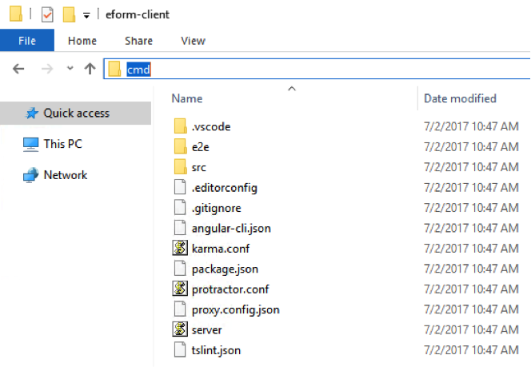
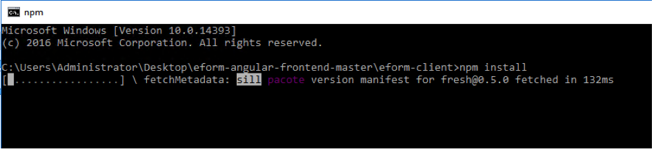
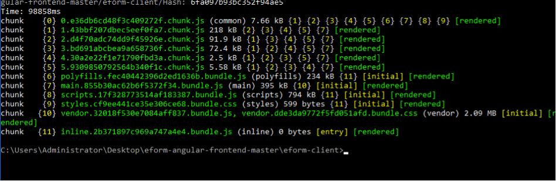
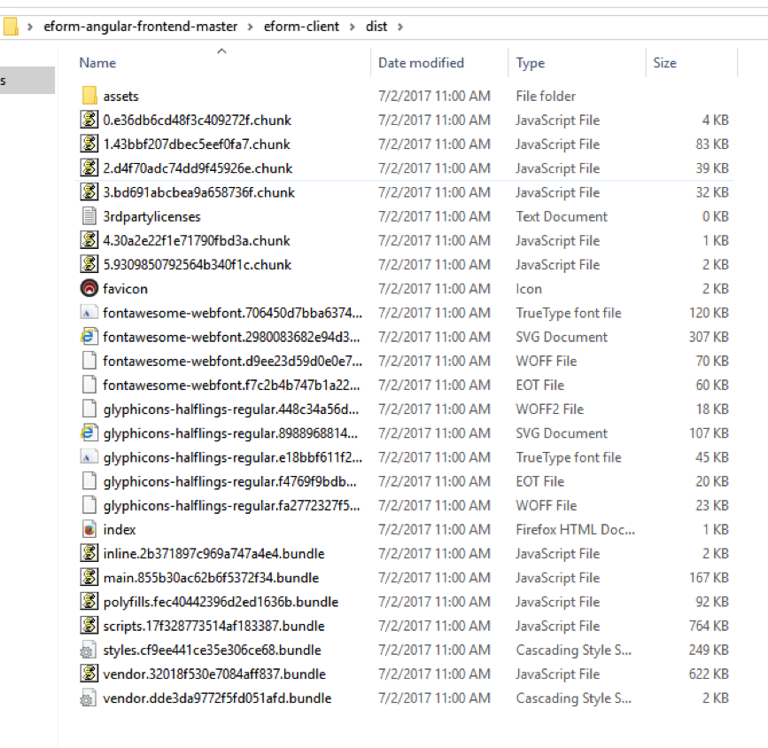
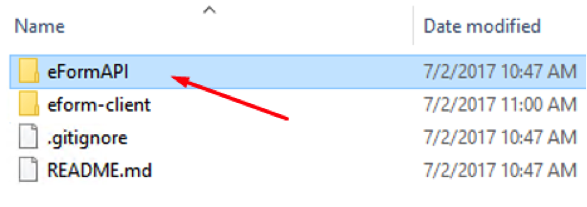
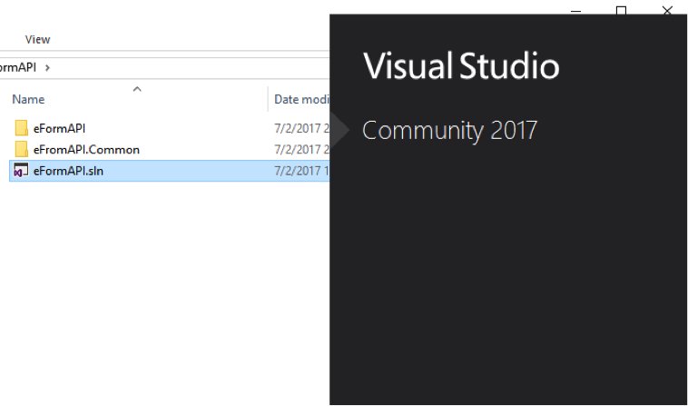
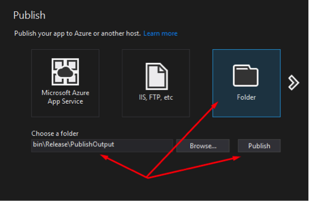
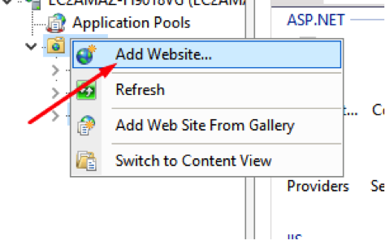
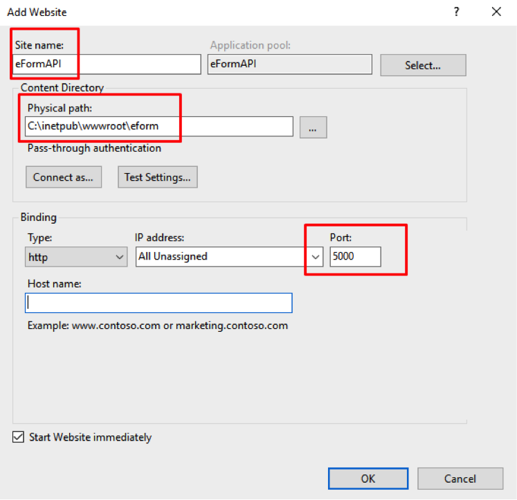

# eform-angular-frontend

A Angular2 Frontend for integrating with the Microting eForm API v1.

## Support Platforms

 - .NET Framework 4.5+
 - Windows 7 SP1
 - MS SQL 2008 R2

## Get access token

You need to create an account for Microting API and get your access credentials.

 - Call Microting at +45 66 11 10 66 to get started.

## Development recommendations

  - Visual Studio 2015
  - MS SQL Server Management Studio
  - Node.js
  
  
## Installation
  
  #### 1. Node.js & npm installation
  
  1. Go to Node.js website [https://nodejs.org/en](https://nodejs.org/en)
    
  2. Download and run node.js installer
  3. Check "npm package manager" & "Add to PATH" (they should be checked by default.)
    

    
  #### 2. Downloading latest eForm Angular version
    
  1. Go go [https://github.com/microting/eform-angular-frontend](https://github.com/microting/eform-angular-frontend)
  2. Download ZIP-Archive with the latest version of application
    
  3. Extract the files
  
  #### 3. Build Angular application
  
  1. Go go Angular application folder
    
  2. Call **cmd** from your Angular folder
    
  3. Call **npm install**
    
  4. Then call **npm run build**
    
  5. Angular application has been built and extracted to **dist** folder
    
    
  #### 4. Build WEB API application
    
  1. Go to the API folder
    
  2. Open eFormAPI.sln in Visual Studio
    
  3. Press CTRL+SHIFT+B to build and restore packages
  4. Click publish for .Web project
    
  5. Select path and clich Publish
    
  6. Now you have a compiled API application
    
  
    
  #### 5. Publish WEB API application
  
  1. Install Internet Information Services if not already installed.    
        1. Press the Windows Key and type Windows Features, select the first entry "Turn Windows Feature On of Off"
        2. Check "Internet Information Services" and click OK
  2. Copy compiled files to forlder in server
    
  3. Open Internet Information Services (IIS) Manager
     
  4. Click Add Website
     
  5. Fill all required settings
     
  
  
  
## License

The MIT License (MIT)

Copyright (c) 2007-2017 microting

Permission is hereby granted, free of charge, to any person obtaining a copy
of this software and associated documentation files (the "Software"), to deal
in the Software without restriction, including without limitation the rights
to use, copy, modify, merge, publish, distribute, sublicense, and/or sell
copies of the Software, and to permit persons to whom the Software is
furnished to do so, subject to the following conditions:

The above copyright notice and this permission notice shall be included in all
copies or substantial portions of the Software.

THE SOFTWARE IS PROVIDED "AS IS", WITHOUT WARRANTY OF ANY KIND, EXPRESS OR
IMPLIED, INCLUDING BUT NOT LIMITED TO THE WARRANTIES OF MERCHANTABILITY,
FITNESS FOR A PARTICULAR PURPOSE AND NONINFRINGEMENT. IN NO EVENT SHALL THE
AUTHORS OR COPYRIGHT HOLDERS BE LIABLE FOR ANY CLAIM, DAMAGES OR OTHER
LIABILITY, WHETHER IN AN ACTION OF CONTRACT, TORT OR OTHERWISE, ARISING FROM,
OUT OF OR IN CONNECTION WITH THE SOFTWARE OR THE USE OR OTHER DEALINGS IN THE
SOFTWARE.
