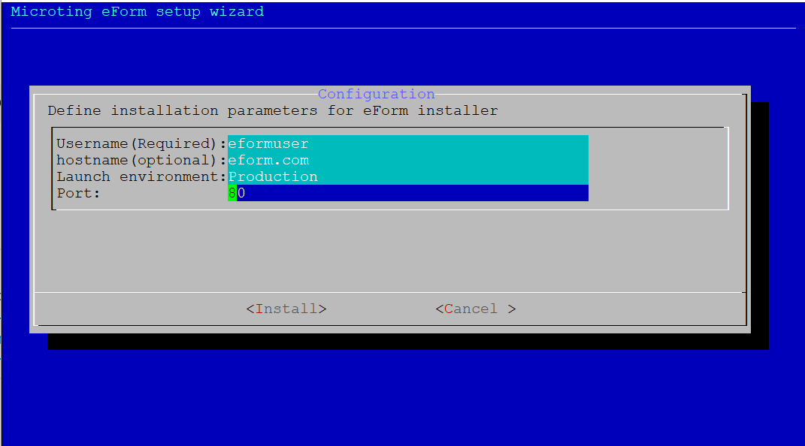

# eFrom installation script

## Preparing

Recommended distributive - __Ubuntu 18.04__

### Swapfile

If you have 1Gb and less RAM on server/PC, you need to configure swap on system

Run __cat__ to check does your system have a swap file

```bash
cat /proc/swaps
```

If no swap file or partition is available - you can create swapfile with commands below

```bash
sudo fallocate -l 4G /swapfile
sudo chmod 600 /swapfile
sudo mkswap /swapfile
sudo swapon /swapfile
echo '/swapfile none swap sw 0 0' | sudo tee -a /etc/fstab
```

### Create non-root user

Script should be launched via Non-root user via sudo.

Exec adduser to create new user in system

```bash
adduser eformuser
```

Give sudo privileges to user

```bash
usermod -aG sudo eformuser
```

Logout and login to created user

if you are in root, you can run __su__ to login as new user

```bash
su - eformuser
```

### Setup plugin install service


Create file
```bash
touch /tmp/install.sh
```

Make it executable
```bash
sudo chmod +x /tmp/install.sh
```

Go to services folder
```bash
cd /etc/systemd/system/
```

Create new file by script
```bash
nano plugin-install.service
```

And insert this text
```bash
[Unit]
Description=Plugin install service

[Service]
Type=oneshot
User=root
ExecStart=/tmp/install.sh
StandardOutput=journal
```

go to folder
```bash
cd /var/lib/polkit-1/localauthority/10-vendor.d/
```

create new file
```bash
nano plugin.pkla
```

And insert this text
```bash
[plugin unit]
Identity=unix-user:USER
Action=org.freedesktop.systemd1.manage-units
ResultAny=yes
```

**USER** - should be your eform user username


### Downloading script

Use wget to download script

```bash
wget https://raw.githubusercontent.com/microting/eform-angular-frontend/master/install.sh
```

Make script executable

```bash
sudo chmod +x install.sh
```

## Running script

Launch script with command

```bash
sudo ./install.sh
```

You should see this window: 


Configuration wizard ask you a 4 parameters to setup

* Username
  * Non-root username who launched that script
    (used for building app at your home directory)
* Hostname
  * Hostname that NGINX should use as route to webapp
  * Leave blank for localhost path
  * __Example__: myeform.com
* Launch environment:
  * Which launching environment should use dotnet
  * __Available values__: _Development_, _Production_
  * __Default value__: _Production_
  * Leave default value if you plan to work only with eForm dashboard
* Port
  * Defines on which port application will be available
  * __Default value__: 80

Script can be launched with key parameters:
```
sudo ./install.sh --port=80 --hostname=example.org --launch-env=Production --username=user --ssl --silent
```

```BASH
--port= - Defines on which port application will be available
--hostname= - Hostname that NGINX should use as route to webapp
--launch-env= -Which launching environment should use dotnet
--username= - Non-root username who launched that script
--ssl - Setup SSL
--silent - enables non-interactive installation mode
```

## Installation process

All installation process is automated, after installation eFrom application will be available on host and port that you specified in configuration

## Error solving

If app is not launched or something missing - check __errlog__ file for more info about installation process
