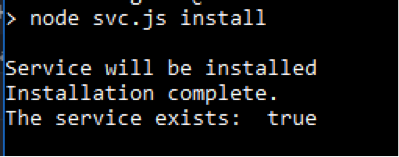
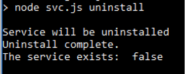
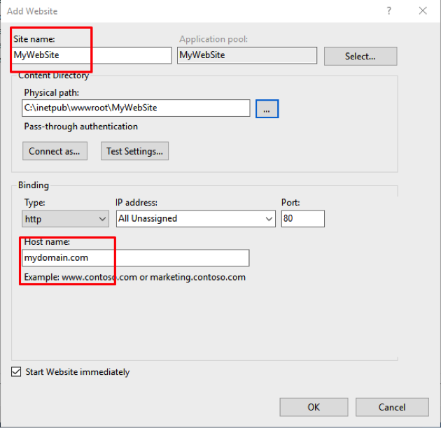
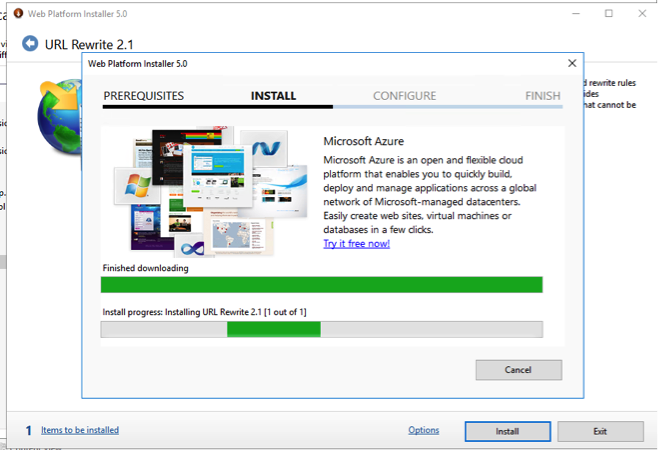

  # Installation
  
  # WARNING! This is still work in progress!
  
  #### 1. Node.js & npm installation
  
  1. Go to Node.js website [https://nodejs.org/en](https://nodejs.org/en)
  
  2. Download and run node.js installer
  3. Check "npm package manager" & "Add to PATH" (they should be checked by default.)
  

    
  #### 2. Downloading latest eForm Angular version
    
  1. Go go [https://github.com/microting/eform-angular-frontend](https://github.com/microting/eform-angular-frontend)
  2. Download ZIP-Archive with the latest version of application
  
  3. Extract the files
  
  #### 3. Build Angular application
  
  1. Go go Angular application folder
  
  2. Call **cmd** from your Angular folder
  
  3. Call **npm install**
  
  4. Then call **npm run build**
  
  5. Angular application has been built and extracted to **dist** folder
  
    
  #### 4. Build WEB API application
    
  1. Go to the API folder
  
  2. Open eFormAPI.sln in Visual Studio
  
  3. Press CTRL+SHIFT+B to build and restore packages
  4. Click publish for .Web project
  
  5. Select path and clich Publish
  
  6. Now you have a compiled API application
  
  
    
  #### 5. Publish WEB API application
  
  1. Install Internet Information Services if not already installed.    
        1. Press the Windows Key and type Windows Features, select the first entry "Turn Windows Feature On of Off"
        2. Check "Internet Information Services" and click OK
  2. Copy compiled files to forlder in server
  
  3. Open Internet Information Services (IIS) Manager
  
  4. Click Add Website
  
  5. Fill all required settings
  
    
  #### 6.1 Running Angular as a console application
    
  1. Go go the angular folder and run **cmd**
  2. If you did not build the application before call **npm install** and then **npm run build**
  3. Call **npm run server**
  
  4. Now application is working, don't close the command prompt when app is working (if you want to stop it - press **CTRL+C** to times)
      
  #### 6.2 Running Angular as a Windows Service

  1. Modify svc.js name to have a unique name according to your needs. Default is to leave it as is.
  ```javascript
  var svc = new Service({
	  name: 'eForm angular',
	  description: 'eForm angular frontend application',
	  script: 'server.js'
	});
  ```
  2. Modify server.js for the port no according to your needs. Default is to leave it as is.
  ```javascript
	const defaultPort = 3000;

	// proxy
	var apiProxy = httpProxy.createProxyServer();
	var apiForwardingUrl = 'http://localhost:5000/';
	apiProxy.on('error', function(e) {
	  console.error('Error:');
	  console.info(e);
	  console.log('-------------------------------------');
	});
  ```
  3. Go to the Angular folder and type **cmd**
  
  4. install node-windows with npm, unsing the global flag
    **npm install -g node-windows**
  5. Then call **npm link node-windows**
  6. If you want to install and start the service, call **npm run winserver-install**
  
  7. Now you application has been started as a Windows Service
  
  8. If you want to stop & uninstall, call **npm run winserver-uninstall**
  
    
    
  #### 7. Binding host name to website
    
  1. Click Add Website and fill all fields in IIS Manager
  
  2. Install **URL Rewrite extension**
  [https://www.iis.net/downloads/microsoft/url-rewrite](https://www.iis.net/downloads/microsoft/url-rewrite)
  3. Install **APP Requst Routing** extension
    [https://www.iis.net/downloads/microsoft/application-request-routing](https://www.iis.net/downloads/microsoft/application-request-routing)
  
  4. Select Rewrite in your website section
  
  5. Add new rule
    
  6. Click on Reverse Proxy
  
  7. Add to rules localhost:300 (same as our angular app)
  
  8. Then go to website  
  

  #### 8. Using Lets encrypt to setup SSL ####
  
  2. Setup rule to allow letsencrypt-win-simple handle the certificate
  5. Add new rule
  6. Click on blank rule
  7. Enter patteren .well-known and set Using to Regular Expression, set Action type to "None" and check "Stop processing of subsequent rules"
  1. Download [https://github.com/Lone-Coder/letsencrypt-win-simple](https://github.com/Lone-Coder/letsencrypt-win-simple)

  #### 9. Set auto upgrade from http to https ####
  
  1. Follow the guide on [https://blogs.technet.microsoft.com/dawiese/2016/06/07/redirect-from-http-to-https-using-the-iis-url-rewrite-module/](https://blogs.technet.microsoft.com/dawiese/2016/06/07/redirect-from-http-to-https-using-the-iis-url-rewrite-module/)
  2. Move the rule, so its no 2 in the list
  